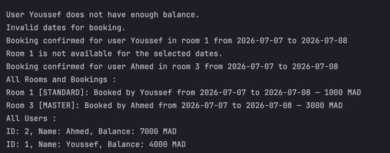

# Hotel Reservation System – Technical Test

A multi-thread-safe hotel reservation system built in Java.  
It supports room creation, user registration, and conflict-free room bookings.

---

## Features

- Create and update rooms with type and price
- Create users with initial balance
- Book rooms for date ranges (with overlap detection)
- Prevents double-booking using thread-safe logic
- Prints all bookings and users in order

---

## Design Highlights

- **Thread Safety**: `synchronized` blocks and concurrent collections (`ConcurrentHashMap`, `synchronizedList`) ensure no double-booking
- **SOLID Principles**: clear separation of models, services, and business logic
- **Booking Snapshot**: each booking stores a copy of room and user info at booking time (price/type), keeping history intact even if rooms are later updated

---

## Example Scenario (Run from `Main.java`)

- Creates three rooms and two users
- Handles valid and invalid bookings
- Updates room info after booking
- Final output:
    - `printAll()` → shows all bookings
    - `printAllUsers()` → shows remaining balances

---

## Project Structure

```
src/
└── model/           # Room, User, Booking, RoomType
└── service/         # ReservationService interface
└── service/impl/    # ReservationServiceImpl with core logic
└── HotelReservationSystemApp.java  # Main scenario runner
```

---
## Screenshots of printAll(...) and printAllUsers(...)
result.



---
Built by Youssef for the SkyPay technical test.

## Design Question

`1 - Suppose we put all the functions inside the same service. Is this the
recommended approach ? Please explain.`

No, it is not recommended. Grouping all logic (user, room, booking, printing) into one 
service violates the Single Responsibility Principle (SRP) and reduces maintainability.
A better approach is to split logic into multiple services (e.g., UserService, 
RoomService, BookingService) to improve modularity, testability, and scalability.

`2 - In this design, we chose to have a function setRoom(..) that should
not impact the previous bookings. What is another way ? What is your
recommendation ? Please explain and justify.`
Yes, this is a good design. It ensures historical consistency by storing a snapshot of 
room details (type, price) in the booking at the time of reservation. An alternative 
would be referencing the live Room object, but this risks modifying past bookings if 
the room is updated later.

